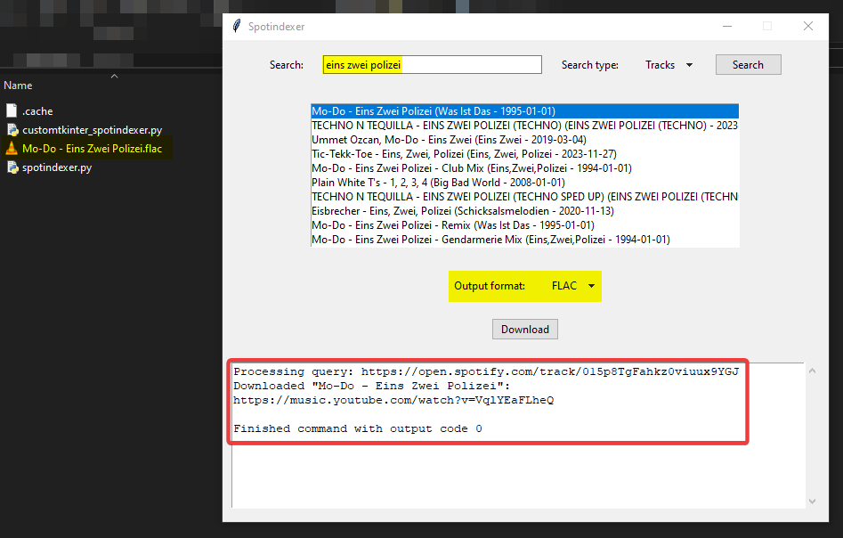
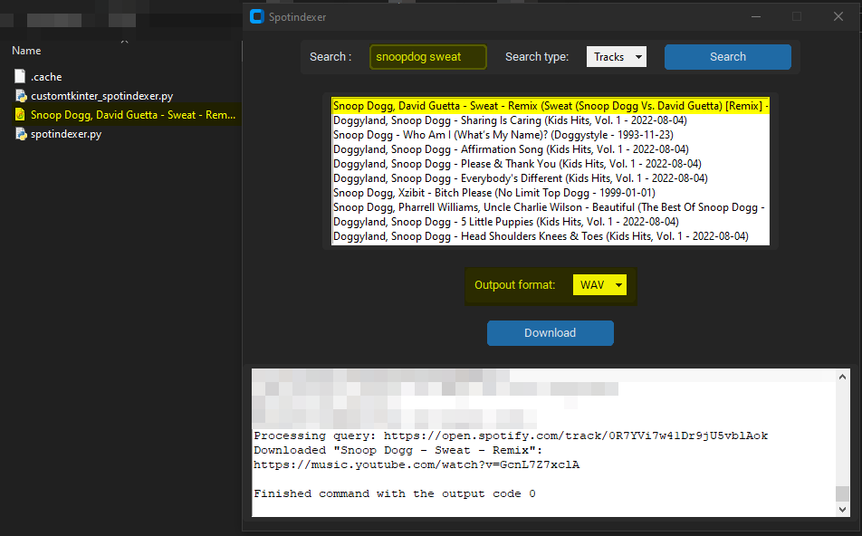

# spotindexer
A Python Spotify downloader

### Installation

1. Downloaded repo
2. Install these modules : `tkinter, customtkinter*, spotipy, spotdl`
3. Run `spotindexer.py` or `ctk_spotindexer.py`

**optionnal if you use only `spotindexer.py` and not `ctk_spotindexer.py`.*

### Images

Tkinter

Customtkinter

